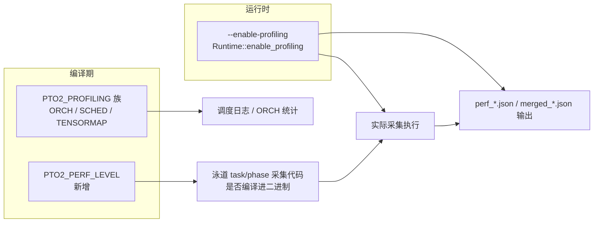

# PTO2_PERF_LEVEL 与泳道采集隔离（仅 tensormap_and_ringbuffer）

## 三轴独立约定

本计划引入**三个相互独立的维度**：

| 维度 | 类型 | 控制内容 | 现有关系 |
|------|------|----------|----------|
| `PTO2_PROFILING` / `PTO2_ORCH_PROFILING` / `PTO2_SCHED_PROFILING` / `PTO2_TENSORMAP_PROFILING` | 编译期宏 | 调度器循环计时日志、ORCH 子步骤周期统计、sched 汇总日志等 | ORCH/SCHED/TENSORMAP 仍依赖 PROFILING，**层级关系不变** |
| `PTO2_PERF_LEVEL` | 编译期宏（新增） | 泳道 task/phase 数据采集代码是否编译进二进制 | **与 PTO2_PROFILING 族完全解耦，无 #error 依赖** |
| `--enable-profiling` / `Runtime::enable_profiling` | 运行时开关 | 是否实际执行初始化、写缓冲、导出 perf_*.json / merged_*.json 文件 | 始终是文件落盘的唯一运行时控制 |

> **`--enable-profiling` 不是编译宏**：它经 `chip_worker.cpp → enable_runtime_profiling` 设置 `Runtime::enable_profiling`，在 shutdown 时触发 `export_swimlane_json()`。它只控制"是否导出文件"，与 `PTO2_PROFILING` 这些编译宏无关。



## 背景与现状

- **`PTO2_PROFILING`**（[pto_runtime2_types.h:43](src/a2a3/runtime/tensormap_and_ringbuffer/runtime/pto_runtime2_types.h#L43)，默认 1）：在 `aicpu_executor.cpp`、`pto_orchestrator.cpp` 等处**同时**控制：调度器循环 `CYCLE_COUNT_START/LAP` 计时、`perf_aicpu_*` 与 phase 初始化、orchestrator 的 `enable_profiling` 字段存在与否、orch 侧 `CYCLE_COUNT_LAP_RECORD` 等——**当前泳道采集与日志统计耦合在同一宏下**。
- **`PTO2_ORCH_PROFILING`**（默认 0，需 `PTO2_PROFILING=1`）：[pto_orchestrator.cpp:38-88](src/a2a3/runtime/tensormap_and_ringbuffer/runtime/pto_orchestrator.cpp#L38-L88) 的第一分支，在此分支下 `CYCLE_COUNT_LAP_RECORD` **无 `enable_profiling` 门控**，直接调用 `perf_aicpu_record_orch_phase`。
- **JSON `version`**：[performance_collector.cpp:1254](src/a2a3/platform/src/host/performance_collector.cpp#L1254) 已写 `version = has_phase_data_ ? 2 : 1`。level 1 不调 `init_phase_profiling` / 不写 phase 区域 → `has_phase_data_` 为假 → 自然得到 version 1；level 2 全量 → version 2。**无需改 platform 侧导出逻辑**。

## 宏语义（约定）

| `PTO2_PERF_LEVEL` | 编译进二进制的泳道采集 | 与 `enable_profiling` 配合 | 输出 JSON version |
|---|---|---|---|
| **0** | 无 task/phase 采集路径 | 即使 `--enable-profiling` 也不初始化 perf buffer，导出无数据 | — |
| **1** | 仅 **task 级**（AICore `perf_aicore_record_task`、AICPU task dispatch/finish 写 `PerfBuffer`） | `enable_profiling==true` 时才执行热路径写入 | **1** |
| **2** | 在 1 基础上增加 **sched phase + orch phase**（`perf_aicpu_init_phase_profiling`、`perf_aicpu_record_phase`、`perf_aicpu_record_orch_phase`、flush 等） | 同上 | **2** |

在 [`pto_runtime2_types.h`](src/a2a3/runtime/tensormap_and_ringbuffer/runtime/pto_runtime2_types.h) 追加（放在现有 `PTO2_TENSORMAP_PROFILING` 校验块**之后**，与 PROFILING 族无依赖关系）：

```cpp
// PTO2_PERF_LEVEL: swimlane data collection level (independent of PTO2_PROFILING)
//   0 = no collection, 1 = task only, 2 = task + sched/orch phase (full)
#ifndef PTO2_PERF_LEVEL
#define PTO2_PERF_LEVEL 2
#endif
#if PTO2_PERF_LEVEL < 0 || PTO2_PERF_LEVEL > 2
#error "PTO2_PERF_LEVEL must be 0, 1, or 2"
#endif
// Convenience aliases (header-only, use in #if conditions)
#define PTO2_PERF_TASK  (PTO2_PERF_LEVEL >= 1)
#define PTO2_PERF_PHASE (PTO2_PERF_LEVEL >= 2)
```

## 时间打点与消费对齐

**总原则**：凡是 `get_sys_cnt_aicpu()` / `get_sys_cnt_aicore()`，必须与其**实际消费点**处于同一逻辑条件内。消费点包括：写入 `PerfBuffer`、写入 phase 记录、累加到 `g_orch_*_cycle` 等统计量、最终会输出的日志变量。禁止「先读后丢」。

### 泳道路径（`PTO2_PERF_LEVEL` + `enable_profiling`）

- **Level 0**：不编译任何仅为泳道服务的时间戳读取。
- **Level 1（task）**：task 起止 / dispatch / finish 读周期仅在 `PTO2_PERF_TASK && enable_profiling` 为真时执行；AICore 侧 **`start_time` 与 `end_time` 须一同**放在 `profiling_enabled` 为真的分支内（禁止在 `if` 外先读 `start_time`）。
- **Level 2（phase）**：sched/orch phase 的 `_t0_phase`、分段 lap 等，仅在 `PTO2_PERF_PHASE && enable_profiling` 为真时进入，与 `perf_aicpu_record_phase` / `perf_aicpu_record_orch_phase` 同一分支。

### Profiling 宏路径（`PTO2_PROFILING` / `PTO2_ORCH_PROFILING` / `PTO2_SCHED_PROFILING`）

- **`PTO2_PROFILING=1`**：`CYCLE_COUNT_START / LAP` 的消费端是线程结束时的 scheduler 汇总日志（`sched_*_cycle → DEV_ALWAYS`），不受 `enable_profiling` 控制，保持现状。
- **`PTO2_ORCH_PROFILING=1`**：`g_orch_*_cycle` 累加保留；`perf_aicpu_record_orch_phase` 调用加 `PTO2_PERF_PHASE && orch->enable_profiling` 门控（拆分「累加」与「写泳道」）。
- **`PTO2_SCHED_PROFILING`**：`t_pop_start`、`t_setup_start` 等保持现状。

## 关键代码改动点（仅 a2a3 tensormap_and_ringbuffer）

### 1. [`pto_orchestrator.h`](src/a2a3/runtime/tensormap_and_ringbuffer/runtime/pto_orchestrator.h)

当前（[line 63-66](src/a2a3/runtime/tensormap_and_ringbuffer/runtime/pto_orchestrator.h#L63-L66)）：

```cpp
#if PTO2_PROFILING
    bool enable_profiling;
#endif
```

改为：

```cpp
#if PTO2_PROFILING || PTO2_PERF_LEVEL >= 1
    bool enable_profiling;
#endif
```

确认所有写入 `PTO2OrchestratorState` 的翻译单元与新 struct 布局一致。

### 2. [`pto_orchestrator.cpp`](src/a2a3/runtime/tensormap_and_ringbuffer/runtime/pto_orchestrator.cpp) 宏块重写

现有三分支（[line 38-115](src/a2a3/runtime/tensormap_and_ringbuffer/runtime/pto_orchestrator.cpp#L38-L115)）改为**四分支**：

```
#if PTO2_ORCH_PROFILING
  // 现有：includes + weak stubs + g_orch_*_cycle 统计量 + g_orch_submit_idx
  // 改动：CYCLE_COUNT_LAP_RECORD 内 perf_aicpu_record_orch_phase 加门控：
  //   #if PTO2_PERF_PHASE
  //   if (orch->enable_profiling) { perf_aicpu_record_orch_phase(...); }
  //   #endif

#elif PTO2_PROFILING
  // 现有：includes + weak stubs + g_orch_submit_idx + 检查 enable_profiling
  // 保持不变（CYCLE_COUNT_LAP_RECORD 已有 _prof_active 门控）

#elif PTO2_PERF_LEVEL >= 2      ← 新增分支
  // 用途：PTO2_PROFILING=0 但 level 2 需要 orch phase 写泳道
  // 需要：includes + weak stubs（get_sys_cnt_aicpu、perf_aicpu_record_orch_phase）
  //        + g_orch_submit_idx
  //        + CYCLE_COUNT_START 检查 enable_profiling
  //        + CYCLE_COUNT_LAP    no-op（无 ORCH 统计量）
  //        + CYCLE_COUNT_LAP_RECORD 检查 enable_profiling 后调 record

#else
  // 全 no-op（PTO2_PROFILING=0 且 PTO2_PERF_LEVEL<2）
```

**关键细节**：

- `g_orch_submit_idx`：每个有效分支（ORCH_PROFILING / PROFILING / 新 PERF_PHASE 分支）均需独立声明。
- `weak hidden` stub：`get_sys_cnt_aicpu` 和 `perf_aicpu_record_orch_phase` 须在新 `#elif PTO2_PERF_LEVEL >= 2` 分支中复制，原因与现有注释相同（防止 HOST .so 污染动态符号表）。
- `g_orch_submit_idx` 递增：收紧为仅在实际写 orch phase 时递增，可与 `CYCLE_COUNT_LAP_RECORD` 使用处对齐，避免 level 0/1 下的无意义计数。

### 3. [`aicpu_executor.cpp`](src/a2a3/runtime/tensormap_and_ringbuffer/aicpu/aicpu_executor.cpp)

分域替换/拆分原 `#if PTO2_PROFILING` 大块：

| 内容 | 原条件 | 新条件 |
|------|--------|--------|
| `perf_aicpu_init_profiling`、`perf_records_addr` handshake、task 完成写 `PerfBuffer`、AICore 协同 task 时间戳 | `PTO2_PROFILING` + `enable_profiling` | `PTO2_PERF_TASK` + `enable_profiling` |
| `perf_aicpu_init_phase_profiling`、`perf_aicpu_set_orch_thread_idx`、`perf_aicpu_record_phase`、`perf_aicpu_flush_phase_buffers` | `PTO2_PROFILING` + `enable_profiling` | `PTO2_PERF_PHASE` + `enable_profiling` |
| 调度循环 `CYCLE_COUNT_START/LAP`、`sched_*_cycle` 累积、scheduler summary 日志、`PTO2_SCHED_PROFILING` 块 | `PTO2_PROFILING` | **保持** `PTO2_PROFILING`（不变） |

模板 `check_running_cores_for_completion` / `dispatch` 的条件参数（当前 [line 359-361](src/a2a3/runtime/tensormap_and_ringbuffer/aicpu/aicpu_executor.cpp#L359-L361)）：

| 参数 | 原条件 | 新条件 |
|------|--------|--------|
| `profiling_enabled` | `PTO2_PROFILING` | `PTO2_PROFILING \|\| PTO2_PERF_TASK` |
| `phase_complete_count` | `PTO2_PROFILING` | `PTO2_PERF_PHASE` |

**初始化顺序**：先 `PTO2_PERF_TASK && enable_profiling` 时调 `perf_aicpu_init_profiling`，再 `PTO2_PERF_PHASE && enable_profiling` 时调 `perf_aicpu_init_phase_profiling`（与现逻辑一致，只是编译条件从 `PTO2_PROFILING` 迁出）。

### 4. [`aicore_executor.cpp`](src/a2a3/runtime/tensormap_and_ringbuffer/aicore/aicore_executor.cpp)

当前问题（[line 121](src/a2a3/runtime/tensormap_and_ringbuffer/aicore/aicore_executor.cpp#L121)）：`start_time` 在 `if (profiling_enabled)` 外无条件读，`end_time` 仅在 if 内读——**先读后丢**。

改为：

```cpp
#if PTO2_PERF_TASK
    if (profiling_enabled) {
        uint64_t start_time = get_sys_cnt_aicore();
        execute_task(payload);
        uint64_t end_time = get_sys_cnt_aicore();
        perf_aicore_record_task(perf_buf, task_id, start_time, end_time);
    } else {
        execute_task(payload);
    }
#else
    execute_task(payload);
#endif
```

`PTO2_PERF_LEVEL=0` 时不编译任何 `perf_records_addr` 读取与计时。

### 5. 构建系统透传

在 tensormap_and_ringbuffer 的 `build_config.py` 或对应 `CMakeLists.txt` 中追加：

```python
# build_config.py 示例
PTO2_PERF_LEVEL = int(os.environ.get("PTO2_PERF_LEVEL", "2"))
extra_compile_args += [f"-DPTO2_PERF_LEVEL={PTO2_PERF_LEVEL}"]
```

或 cmake：

```cmake
set(PTO2_PERF_LEVEL "2" CACHE STRING "Swimlane collection level: 0/1/2")
target_compile_definitions(... PRIVATE PTO2_PERF_LEVEL=${PTO2_PERF_LEVEL})
```

这样 `#ifndef PTO2_PERF_LEVEL / #define PTO2_PERF_LEVEL 2` 的 types.h 默认值仅作兜底，CI 矩阵可显式传三档。

## 刻意不在此计划内修改的部分

- **[`src/a2a3/platform/`](src/a2a3/platform/)**：`performance_collector.cpp` 的 `version = has_phase_data_ ? 2 : 1` 逻辑已自动满足：level 1 不写 phase 区 → `has_phase_data_=false` → version 1；level 2 全量 → version 2。无需改动。
- **`PTO2_ORCH_PROFILING` / `PTO2_SCHED_PROFILING` / `PTO2_TENSORMAP_PROFILING` 的 `#error` 层级依赖**：保持不变。
- **a5 / aicpu_build_graph 等其它 runtime**：不修改。

## 构建与验证建议

编译矩阵（关键组合）：

| `PTO2_PROFILING` | `PTO2_ORCH_PROFILING` | `PTO2_PERF_LEVEL` | `--enable-profiling` | 预期 |
|---|---|---|---|---|
| 1（默认）| 0 | 2 | on | 与当前行为一致，version 2 |
| 1 | 0 | 1 | on | task 数据，version 1，无 phase 段 |
| 1 | 0 | 0 | on | 无 perf 数据 |
| 0 | 0 | 2 | on | 泳道 phase 编译进，version 2；无调度日志 |
| 0 | 0 | 1 | on | task 数据，version 1 |
| 1 | 1 | 2 | on | ORCH 统计 + 全量泳道，version 2 |
| 1 | 0 | 2 | off | 代码编译进但不写入/不导出文件 |

**重点验收**：

- `enable_profiling=false` 时：level 1/2 下不执行任何仅为泳道的 `get_sys_cnt*`。
- `PTO2_PROFILING=0, PTO2_PERF_LEVEL=1` 编译无错：验证模板参数条件拆分正确。
- `PTO2_ORCH_PROFILING=1, PTO2_PERF_LEVEL=1`：ORCH 统计累加正常，`perf_aicpu_record_orch_phase` 不调用（level 1 无 phase）。

## 风险与注意

- **`PTO2_PROFILING=0` + `PTO2_PERF_LEVEL>0`**：`aicpu_executor.cpp` 的模板签名拆分是最高风险点，以 **`grep -n PTO2_PROFILING`** 在 aicpu/aicore 目录下逐项归类到「日志/统计」vs「泳道 task」vs「泳道 phase」，不可遗漏。
- **`weak hidden` stub 必须在每个引用 `get_sys_cnt_aicpu` / `perf_aicpu_record_orch_phase` 的 `#if` 分支中各自声明**，否则 HOST .so 链接时找不到符号或符号污染全局表（见现有注释 [line 44-51](src/a2a3/runtime/tensormap_and_ringbuffer/runtime/pto_orchestrator.cpp#L44-L51)）。
- **Orchestrator struct 布局**：扩展 `enable_profiling` 条件后，确认 `pto2_orchestrator_init`、`aicpu_executor.cpp` 的赋值处以及所有使用 `PTO2OrchestratorState` 的翻译单元与新布局一致。
